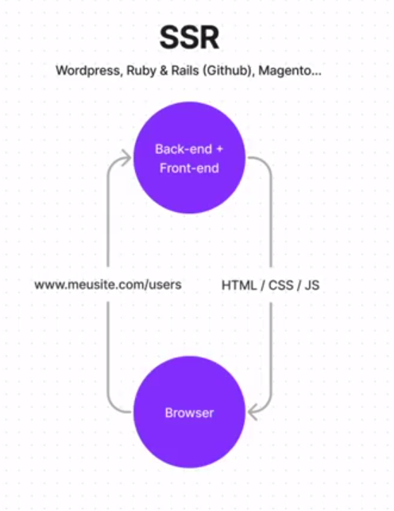

# React

## Fundamentos básicos

###  SSR (Server Side Rendering)

 Padrão tradicional de aplicações web no qual o usuário faz uma solicitação ao servidor e o servidor retorna os arquivos necessários para o cliente conseguir visualizar a aplicação.

 

### SPA (Single Page Application)

 No padrão SPA, a forma na qual a aplicação lida com a solicitação do usuário é diferente, quando o usuário faz a solicitação, chega no servidor backend na qual ele vai pegar todos os dados que é necessário que estão armazenado no banco de dados e envia para a aplicação frontend no formato JSON. 

 

 ### Bundlers e Compilers

 #### Bundler

 O bundler é uma ferramenta que converte vários arquivos JavaScript em um único arquivo que pode ser interpretado por um navegador.

  O motivo pelo qual é necessário o uso do bundler, é que os navegadores não permitia o uso de vários arquivos Javascript na aplicação.

 Modelo de bundler: [WebPack](https://webpack.js.org/)

 #### Compiler
 
 É uma ferrramenta que converte um código criado que pode não ser interpretado por algum navegador para outro código que pode ser interpretado.

 O motivo pelo qual é necessário o uso do compiler, é pelo fator que o javascript atualiza e alguns navegadores ainda não é compatível com a nova funcionalidade. 

 Modelo de compiler: [Babel](https://babeljs.io/)

> [!TIP]
> Atualmente temos o [Vite](https://vitejs.dev/) na qual usaremos que por padrão não necessita o uso das ferramentas citadas pois ele já faz o processo de bundling e o compiler.

## Configurar o primeiro projeto React com Vite

### Requisitos

- [NodeJS](https://nodejs.org/en/) - Versão Long Term Support (LTS)
- [NVM Windows](https://github.com/coreybutler/nvm-windows) - Versionador do 

### Passo a Passo

1. Execute o comando `nvm install lts` e `nvm use lts`.
2. Crie o projeto com Vite `npm create vite@latest`.
3. Selecione o react no projeto.
4. Configure o projeto com o JavaScript.
5. Instale as dependências `npm install`.
6. Inicie o projeto `npm run dev`.
7. Abra o projeto no navegador `http://localhost:5173`.

[Figma](https://www.figma.com/design/k49R157YGPz11ftEB0ohiM/Ignite-Feed-(Community))

> [!TIP]
> O Vite trás uma funcionalidade chamada Fast Refresh que permite que o navegador atualize o código em tempo real sem a necessidade de recarregar a página.


## Fundamentos do React

### 1. Componentes
O uso de compontente é essencial para o desenvolvimento de aplicações React, pois permite que o código seja reutilizado sem a necessidade de repetição.

A estrutura de um componente é composta por uma função que retorna um JSX.

> [!TIP]
> O **JSX(JavaScript XML)** é uma sintaxe que permite o uso de HTML no JavaScript. 

```jsx
// src/App.jsx
export function App() {
  return (
    <h1>Hello World!</h1>
  )
}
```
```jsx
// src/main.jsx
import { App } from './App.jsx'

createRoot(document.getElementById('root')).render(
  <StrictMode>
    <App />
  </StrictMode>,
)
```

### 2. Props (Propriedades)
As props são informações que são passadas para o componente.

```jsx
// src/App.jsx
export function App(props) {
  return (
    <div>
      <h1>Author: {props.author}</h1>
      <p>{props.content}</p>
    </div>
  )
}
```
```jsx
// src/main.jsx
import { App } from './App.jsx'

createRoot(document.getElementById('root')).render(
  <StrictMode>
    <App author="Lucas Bonny" content="Hello World!" />
  </StrictMode>,
)
```

### 3. Estilização CSS Module

Em uma aplicação React com a utilização de componentes precisamos estilizar cada componente de forma que não afete outros componentes.
E para que possamos fazer isso, devemos criar um arquivo CSS com o sufixo `.module.css`.

```css
/* src/components/Header.module.css */
.header {
  background-color: #121214;
  height: 80px;
  z-index: 1;
}
```
```jsx
// src/components/Header.jsx
import styles from './Header.module.css';

export function Header() {
  return (
    // chamar o 'arquivo.classe' para definir o estilo
    <header className={styles.header}>
      <strong>JupiterSass</strong>
    </header>
  );
}
```
```jsx
// src/main.jsx
import { Header } from './components/Header.jsx'

createRoot(document.getElementById('root')).render(
  <StrictMode>
    <Header />
  </StrictMode>,
)
```
### 4. CSS Global

O CSS global adiciona um padrão de estilização para toda a aplicação.

```css
/* src/styles.css */
:root {
    --white: #FFF;
    --gray-100: #e1e1e6;
    --gray-300: #c4c4cc;
    --gray-400: #8d8d99;
    --gray-600: #323238;
    --gray-700: #29292E;
    --gray-800: #202024;
    --gray-900: #121214;

    --green-500: #00875f;
}

*{
    margin: 0;
    padding: 0;
    box-sizing: border-box;
}
body {
    background: var(--gray-900);
    color: var(--gray-300);
    -webkit-font-smoothing: antialiased; /* fonte mais nítida */
}

body, input, textarea, button {
    font-family: 'Roboto', sans-serif;
    font-weight: 400;
    font-size: 1rem;
}
```

> [!TIP]
> No arquivo `index.html` colocaremos o carregamento da fonte Roboto para ser o primeiro link carregado no HTML.

```jsx
// src/index.html
<head>
    <meta charset="UTF-8" />

    <link rel="preconnect" href="https://fonts.googleapis.com" />
    <link rel="preconnect" href="https://fonts.gstatic.com" crossorigin />
    <link href="https://fonts.googleapis.com/css2?family=Roboto:wght@400;700&display=swap" rel="stylesheet" />

    <link rel="icon" type="image/svg+xml" href="/vite.svg" />
    <meta name="viewport" content="width=device-width, initial-scale=1.0" />
    <title>Vite + React</title>
</head>
```

```css
/* src/global.css */
body, input, textarea, button {
    font-family: 'Roboto', sans-serif;
    font-weight: 400;
    font-size: 1rem;
}
```

### 5. Componente Header

O Header é um componente que é reutilizável, o que facilita a manutenção e o desenvolvimento de aplicações.

```jsx
// src/components/Header.jsx
import styles from './Header.module.css';
import logo from '../assets/logo.svg';

export function Header() {
    return (
        <header>
            <div className={styles.header}>
                
                <strong>JupiterSass</strong>
            </div>
        </header>
    );
}
```

```css
/* src/components/Header.module.css */
.header {
    background-color: var(--gray-800);
    display: flex;
    align-items: center;
    justify-content: center;
    padding: 1.25rem 0;
}

.header img {
    height: 3rem;
}
```

> [!TIP]
> O uso da unidade de medida **REM** ajuda a manter a consistência do tamanho da fonte em todo o projeto baseado no tamanho da fonte do usuário.

### 6. Componente Sidebar

Configurando o **App** para receber o Sidebar

```jsx
// src/App.jsx
export function App() {
    return (
        <div>
            <Header />
            <div className={styles.wrapper}>
                <aside> 
                    <Sidebar /> {/* Sidebar */}
                </aside>
                <main>
                    <Post /> {/* Post */}
                    <Post /> {/* Post */}
                </main>
            </div>
        </div>
    );
}
```

```css
/* src/App.module.css */
.wrapper {
    max-width: 70rem; /* Largura máxima */
    margin: 2rem auto; /* Espaçamento vertical */
    padding: 0 1rem; /* Espaçamento horizontal < 70rem */

    display: grid; /* Exibir como grid */
    grid-template-columns: 256px 1fr; /* 1fr = 1 fração do espaço disponível */
    gap: 2rem; /* Espaçamento entre as colunas */
    align-items: flex-start; /* Alinhar os itens no topo */
}
```

Agora iremos criar o **Sidebar**.

```jsx
// src/components/Sidebar.jsx
import styles from './Sidebar.module.css';

export function Sidebar() {
    return (
        <aside className={styles.sidebar}>
            <span></span>
        </aside>
    );
}
```

```css
/* src/components/Sidebar.module.css */
.sidebar {
    background-color: var(--gray-800);
    display: flex;
    align-items: center;
    justify-content: center;
    padding: 1.25rem 0;
}
```